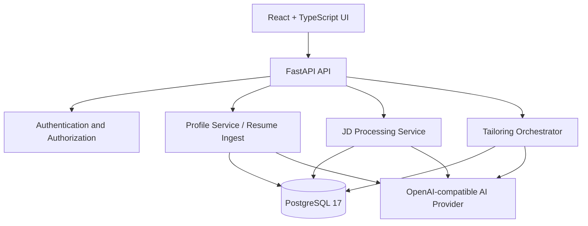

# KnapResume

> Optimal Content Allocation and Provenance Tracking for Job-Aligned Resumes.
> Co-op Project — Chitkara University (Hitkar Miglani, 2310993837).

KnapResume is a professional resume tailoring tool that treats resume generation as a **constrained optimization problem** rather than standard, one-shot LLM document generation. By representing resume space as a knapsack budget and bullet relevance as values, it selects and reformulates the absolute best subset of a user's professional data to perfectly fit a target job description (JD).

---

## Technical Stack

- **Backend**: Python 3.13+, FastAPI (for loopback endpoints), SQLAlchemy 2 (ORM), Alembic (migrations), Psycopg 3 (driver), `pypdf` (binary PDF extractor), `python-docx` (OpenXML Word extractor).
- **Frontend**: React 18, TypeScript, Vite, CSS.
- **Database**: PostgreSQL 17 (accessed locally via standard docker-compose or native services).
- **Quality Gates & Formatting**: `pytest`, `vitest` (component and user-interaction suite), `ruff check` (clean standard formatting rules).

---

## Running Locally

### Prerequisites

- Python 3.13+
- [`uv`](https://docs.astral.sh/uv/)
- Node.js and npm
- Docker Desktop (for PostgreSQL)

### 1. Start PostgreSQL

From the repository root:

```bash
docker compose up -d db
```

The database is available at `127.0.0.1:5432` with the default credentials defined in
`docker-compose.yml`.

### 2. Configure and prepare the backend

From the repository root:

```bash
cd backend
cp .env.example .env
uv sync
uv run alembic upgrade head
```

On Windows PowerShell, use this instead of `cp`:

```powershell
Copy-Item .env.example .env
```

`AI_API_KEY` is optional. Without it, resume and job-description parsing use the
deterministic fallback behavior. If configured, the backend calls the OpenAI-compatible
endpoint specified by `AI_BASE_URL` and `AI_MODEL` in `.env`.

### 3. Start the backend

In the `backend` directory:

```bash
uv run uvicorn app.main:app --host 127.0.0.1 --port 8000 --reload
```

Verify the API is running at `http://127.0.0.1:8000/api/health`.

### 4. Start the frontend

Open a second terminal at the repository root:

```bash
cd frontend
npm install
npm run dev
```

Open the URL printed by Vite, normally `http://127.0.0.1:5173`. The Vite development
server proxies `/api` requests to the backend on port `8000`.

### Running Tests

Backend tests and linting:

```bash
cd backend
uv run pytest
uv run ruff check .
```

Frontend tests and production build:

```bash
cd frontend
npm test -- --run
npm run build
```

### Stopping Local Services

Stop the database from the repository root with:

```bash
docker compose down
```

Use `docker compose down -v` only when you intentionally want to delete the local
PostgreSQL volume and all stored development data.

---

## System Architecture & Flow



---

## Implemented Features

### 1. Account Workspace & Authentication
- Secure email and password register/login using **Argon2id** password hashing.
- State-preserving authenticated server-side cookie sessions.
- Comprehensive synchronizer-token **CSRF protection** on all state-changing endpoints.

### 2. Manual & Automated Profile Acquisition
- **Manual Intake**: Interactive fact insertion with strict single-line NFC normalization (`normalize_fact`), checking for max bounds and stripping leading bullet symbols deterministically.
- **Resume Ingest (Phase 1)**: Robust PDF and Word Document (`.docx`) file upload processing (synchronous, in-memory parsing, max 5MB constraint).
- **Extracted Text Filtering**: Reads and parses nested text from tables, blocks, and paragraphs natively with zero-disk caching.
- **Structured Fact Extraction**: Categorizes history into four key segments (`experience`, `project`, `education`, `skill`) using schema-validated LLM instructions, with a robust deterministic line-by-line fallback parser for offline scenarios.

### 3. Job Description Parsing & Profiling
- Plain-text paste input interface for target JDs.
- Structured AI extraction to yield core technical `skills`, semantic `keywords`, and title `seniority` signals (with localized deterministic regex/years-of-experience fallback).
- Owner-scoped CRUD persistence so users can manage active job descriptions.

### 4. Real-time Profile Completeness Scoring
- Computes profile completeness dynamically. Evaluates subsection data ratios against target constants to produce metrics on a `0.0` to `1.0` scale, combined with an aggregate score.

### 5. Multi-User Isolation / Cascading Deletions
- Complete owner-scoping controls on all API queries to sandbox records.
- Seamless cascaded transaction deletions (`ON DELETE CASCADE`) to instantly hard-delete linked `SourceFact` fields, `Bullet` points, and active session states on resource delete or account de-registration.

---

## Current Status & Roadmap

### [Unreleased] — Completed Slice 3

The **Third Vertical Slice (Phase 1: Resume Ingestion)** is **100% complete and verified**:
- Added pure-python binary extraction filters.
- Created `ResumeImport` models with a separate schema migration `0003_resume_imports`.
- Crafted same-origin, CSRF-protected file upload controllers.
- Multi-part file upload support integrated into the `apiFetch` helper.
- Upgraded the frontend `ProfilePage` with drag-and-drop file forms, uploaded documents list tables, and live data refreshes.
- Validated with complete unit, integration, mock-network, and cascade tests.

### Project Verification Status
- **Backend Quality**: 50/50 test specs passed under `pytest` with clean `ruff` lints.
- **Frontend Quality**: 100% pass rate in vitest and clean build compiler checks.

---

## Next Steps

1. **Phase 2 (Tailoring Core)**: Create role-type classification schema rules and implement initial candidate semantic bullet scoring.
2. **Phase 3 (Optimization Core)**: Formulate the mathematical 0/1 Knapsack optimization algorithm to enforce absolute page line boundaries dynamically.
3. **Phase 4 (Grounded Re-writing)**: Implement metric verification and visual accuracy flags.
