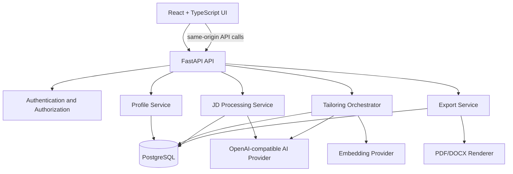
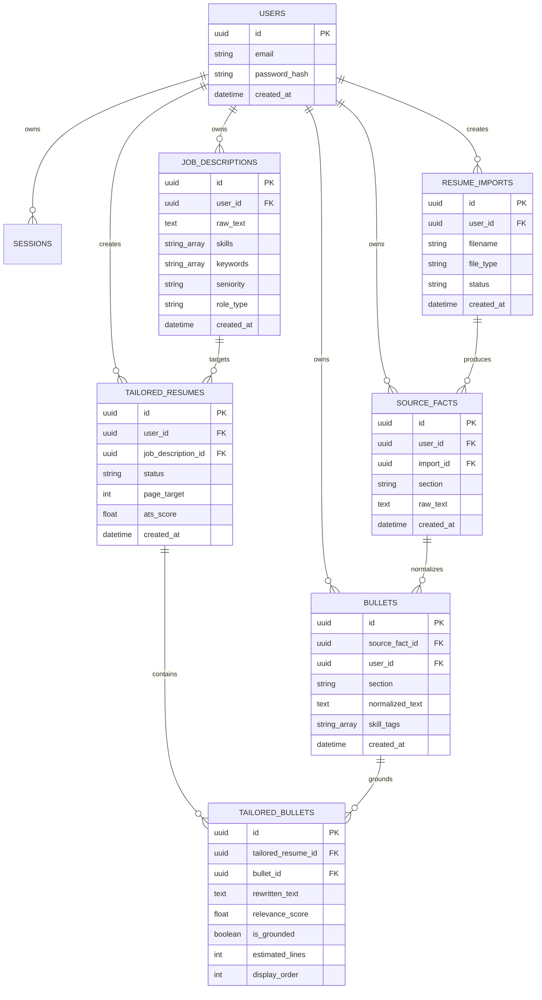
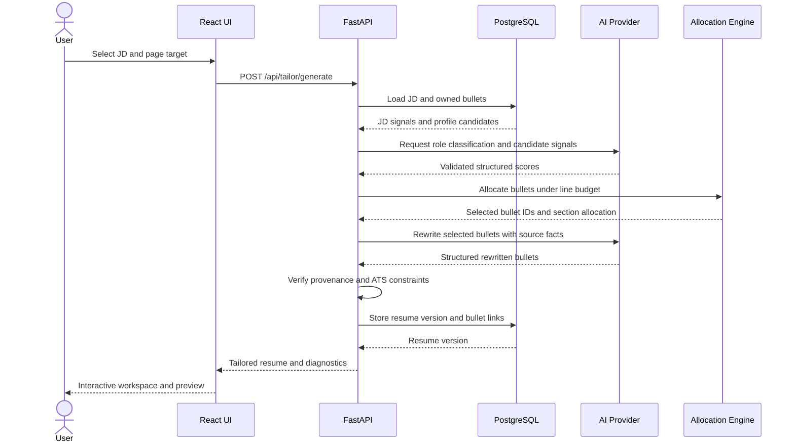
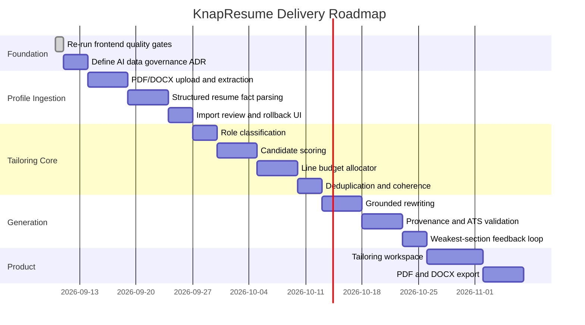

# KnapResume Build Plan

This document defines the next implementation steps for KnapResume, including planned
features, technology choices, architecture, data flow, and delivery phases.

## Current State

Completed:

- Email/password authentication with Argon2id, server-side sessions, and CSRF protection.
- Manual profile fact entry and deterministic bullet normalization.
- Job-description paste input with AI-backed structured parsing and deterministic fallback.
- Owner-scoped job-description persistence and deletion.
- Profile completeness scoring by section.

The next goal is to turn the stored profile and parsed job description into a complete,
grounded, space-constrained tailored resume.

## Product Features

### Profile Acquisition

- Upload PDF and DOCX resumes.
- Extract text and preserve the original import metadata.
- Convert resume content into sectioned source facts and atomic bullets.
- Continue supporting manual fact entry and deletion.
- Add optional GitHub project import with narrowly scoped authorization. Backlogged behind
  Phase 1 resume ingestion; see Recommended Next Slice for sequencing.

### Job Description Processing

- Accept pasted or uploaded job descriptions.
- Extract skills, keywords, seniority, role type, responsibilities, and requirements.
- Remove boilerplate and duplicate signals.
- Show parsing confidence and allow user corrections.

### Tailoring Engine

- Classify the target role and calculate section weights.
- Score every profile bullet against the job description.
- Combine semantic similarity, exact keyword overlap, and evidence quality.
- Select bullets under a one-page or two-page space budget.
- Enforce section minimums and maximums.
- Remove redundant or conflicting bullets.

### Grounded AI Rewriting

- Rewrite selected bullets for relevance and clarity.
- Preserve source facts, dates, technologies, and numeric claims.
- Link every generated bullet to its source bullet.
- Flag unsupported or unverifiable claims.
- Allow users to accept, reject, or edit generated bullets.

### ATS Validation and Feedback

- Check required JD keyword coverage.
- Validate ATS-safe structure and formatting.
- Rank the weakest profile section against the current JD and feed that ranking back into
  profile intake so the user can improve the profile before the next tailoring pass.
- Detect duplicate content and excessive keyword stuffing.
- Show an explainable score rather than an opaque single rating.

### Resume Workspace and Export

- Provide an interactive tailoring workspace.
- Let users toggle bullets and reorder sections.
- Show live page and line-budget usage.
- Preview the final resume.
- Export ATS-safe PDF and editable DOCX.
- Persist resume versions for later editing and download.

## Target Architecture

### Architectural Principles

- Keep the FastAPI application modular by domain rather than by generic utility type.
- Store immutable source facts separately from normalized and generated content.
- Treat AI output as untrusted data that must pass schema validation and provenance checks.
- Keep deterministic scoring, allocation, validation, and authorization in application code.
- Keep provider calls behind interfaces so models and vendors can be changed later.
- Do not send profile data to external providers until consent, retention, deletion, and
  encryption requirements are documented and implemented.
- Keep all user-owned queries scoped by authenticated user ID.

## Technology Stack

| Layer | Technology | Responsibility |
| --- | --- | --- |
| Frontend | React, TypeScript, Vite | Authentication, profile management, tailoring workspace, preview |
| UI testing | Vitest, Testing Library | Component and interaction tests |
| Backend | Python 3.13, FastAPI | HTTP API, orchestration, authorization, validation |
| Persistence | PostgreSQL 17, SQLAlchemy 2, Alembic | User data, source facts, parsed JDs, resume versions |
| Authentication | Argon2id, server-side sessions, CSRF tokens | Account and browser session security |
| AI | OpenAI-compatible Chat Completions API | Structured extraction and grounded rewriting |
| Similarity | Provider embeddings or local vector implementation | Semantic bullet/JD comparison |
| Optimization | Deterministic Python solver, then PuLP or OR-Tools if needed | Space-constrained bullet allocation |
| PDF parsing | `pypdf` | PDF text extraction |
| DOCX parsing | `python-docx` | DOCX text extraction |
| PDF export | HTML/CSS renderer or ReportLab | ATS-safe PDF output |
| DOCX export | `docxtpl` or `python-docx` | Editable document output |
| Development | Docker Compose, PostgreSQL, pytest, Ruff | Reproducible local development and quality gates |

## Pipeline

## Data Model

## Tailoring Request Flow

## Implementation Phases

### Phase 0: Quality and Governance

- Re-run backend and frontend quality gates.
- Add an ADR for AI provider retention, consent, deletion, and logging boundaries.
- Add provider timeout, retry, rate-limit, and error telemetry policy.
- Keep synthetic data as the default test fixture.

### Phase 1: Resume Ingestion

- Add `resume_imports` and import status fields.
- Add authenticated `POST /api/profile/import` multipart endpoint.
- Validate file type, size, content, and ownership.
- Extract PDF/DOCX text without logging uploaded content.
- Parse extracted text into reviewable source facts.
- Make import deletion remove dependent facts and bullets.

### Phase 2: Tailoring Scoring

- Add role-type classification with deterministic fallback.
- Implement keyword overlap and semantic similarity scoring.
- Expose a preview endpoint before generation.
- Store score explanations so users can understand selection decisions.

### Phase 3: Space-Constrained Allocation

- Define page templates and line-budget rules for the one-page baseline budget.
- Estimate bullet line usage deterministically.
- Implement 0/1 allocation with section constraints.
- Add tests for budget overflow, required sections, and tie-breaking.
- Add coherence and duplicate detection after selection.
- A two-page budget is out of scope for this phase; propose it as a separate ADR if needed.

### Phase 4: Grounded Generation and ATS Safety

- Rewrite only selected bullets and pass source facts as grounding context.
- Require structured AI output for every rewrite.
- Verify dates, technologies, metrics, and entities against source content.
- Flag uncertain claims rather than silently accepting them.
- Add ATS keyword and formatting diagnostics.
- Compute the JD-specific weakest profile section and expose it as a feedback signal that
  the profile intake UI can surface for iterative improvement.

### Phase 5: Workspace and Export

- Add `/tailor/:jobDescriptionId` workspace route.
- Display selected bullets, rejected candidates, budget usage, and warnings.
- Support user toggles, ordering, edits, and regeneration.
- Persist named resume versions.
- Add PDF and DOCX exports with deterministic templates.
- Add end-to-end tests for generation, editing, and download.

## Initial API Surface

| Endpoint | Purpose |
| --- | --- |
| `POST /api/profile/import` | Upload and parse a PDF/DOCX resume |
| `GET /api/profile/imports` | List the user's imports |
| `DELETE /api/profile/imports/{id}` | Delete an import and derived facts |
| `POST /api/tailor/score` | Score profile bullets against a JD |
| `POST /api/tailor/generate` | Allocate and generate a tailored resume |
| `GET /api/tailor/{id}` | Retrieve a tailored resume version |
| `PATCH /api/tailor/{id}` | Save user edits and ordering |
| `POST /api/tailor/{id}/export` | Generate PDF or DOCX output |

## Quality Gates

- Every endpoint has authentication, ownership, validation, and error-path tests.
- AI responses use schema validation and bounded input/output sizes.
- Generated claims retain source-bullet provenance.
- Deterministic fallback behavior exists for extraction and scoring where practical.
- Allocation never exceeds the configured page budget.
- Uploaded content and provider payloads are excluded from logs.
- Backend: `pytest` and `ruff check` pass.
- Frontend: `npm test -- --run` and `npm run build` pass.
- Migration tests cover account deletion and owner isolation.

## Recommended Next Slice

Implement **Phase 0 followed by Phase 1**. Resume ingestion creates the missing bridge between
the existing manual profile workflow and the automated tailoring pipeline. It should be built
before scoring or rewriting so all later features operate on realistic, provenance-linked
profile data.

GitHub project import is deferred behind Phase 1 (PDF/DOCX ingestion) and is not yet assigned
a phase; revisit it once Phase 1 ships so it doesn't silently drop out of scope.
